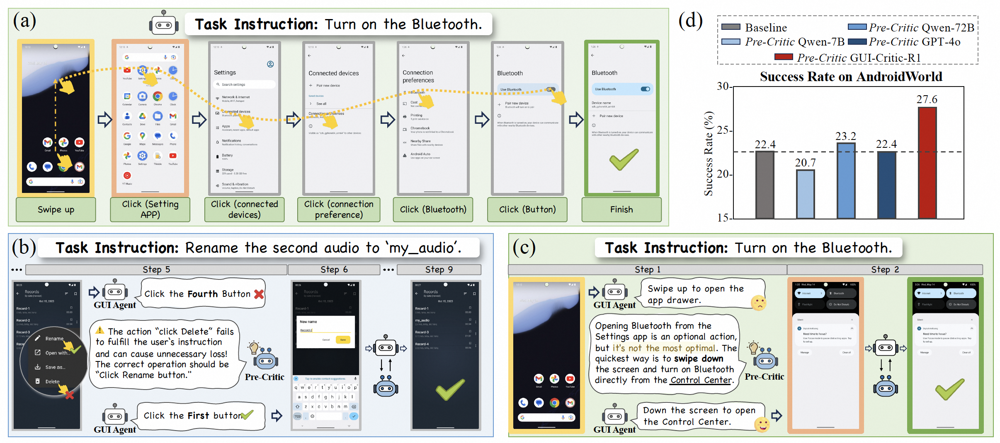

# Look Before You Leap: 用于 GUI 自动化操作前错误诊断的 GUI-Critic-R1 模型
此存储库包含该论文的官方实现：[三思而后行：用于 GUI 自动化中术前错误诊断的 GUI-Critic-R1 模型](https://arxiv.org/abs/2506.04614)。

<div align="center">
<a href="README_zh.md">简体中文</a> | <a href="README.md">English</a>
<hr>
</div>
 
## 📢 新闻
🔥[2025-06-06] 我们发布测试代码来评估 GUI-Critic-R1（即将在 Hugging Face 上发布）在 GUI-Critic-Test 数据集上的性能。


## 📋 介绍
与一般的离线多模态任务不同，GUI 自动化是在在线交互环境中执行的，因此需要根据环境的实时状态逐步进行决策。
此类任务对每一步决策错误的容忍度较低，因为任何错误都可能累积起来扰乱整个流程，并可能导致不可逆转的后果，例如删除或付款。
为了解决这些问题，我们引入了一个预操作评价模型 **GUI-Criti-R1**，该模型通过推理潜在结果和操作的正确性，在实际执行之前提供有效的反馈。
我们提出了基于建议感知的梯度相对策略优化 (S-GRPO) 策略来构建我们的预操作评价模型 GUI-Critic-R1，并结合了新颖的建议奖励机制来增强模型反馈的可靠性。
此外，我们开发了一个基于推理引导的数据收集流程，用于创建 GUI-Critic-Train 和 GUI-Critic-Test，从而填补了 GUI 评价数据中的现有空白。
在移动和 Web 领域的 GUI-Critic-Test 静态实验表明，与当前的 MLLM 相比，我们的 GUI-Critic-R1 在 Critic 准确率方面具有显著优势。
在 GUI 自动化基准测试上的动态评估进一步凸显了我们模型的有效性和优越性，成功率和运行效率的提升就是明证。

## 📍 TODO
- [ ] 发布测试数据图像
- [ ] 发布模型检查点
- [ ] 发布 GUI-Critic-Train 数据集
- [ ] 发布在 AndroidWorld 基准测试中应用 GUI-Critic-R1 的测试代码


## 💡 在GUI-Critic-Test上测试
### 📑 文件

- `test.py`：用于在 Hugging Face 模型上运行评估的主脚本。
- `statistic.py`：包含评估函数和指标计算。
- `test_files/`：包含测试文件的目录：
  - `gui_i.jsonl`：GUI-I 数据集的测试数据
  - `gui_s.jsonl`：GUI-S 数据集的测试数据
  - `gui_web.jsonl`：GUI-W 数据集的测试数据
  
### 🔧 使用

1. 在 requirement.txt 中安装所需的依赖项
`pip install -r requirements.txt`
2. 在 `statistic.py` 中配置 Qwen-72B 的 API。您需要设置 API 密钥和端点，才能使用 Qwen-72B 模型进行建议有效性计算。
3. 运行主评估脚本：

`python test.py --model_dir <model_directory>
--test_file <test_file_path>
--save_dir <output_directory>
--data_dir <dataset_directory>`

参数说明：
  - `--model_dir`：包含模型的目录
  - `--test_file`：测试文件的路径
  - `--save_dir`：保存结果的目录
  - `--data_dir`：包含数据集的目录

## 📑引用

如果您发现 Mobile-Agent 对您的研究和应用有用，请使用此 BibTeX 进行引用：
```
@article{wanyan2025look,
  title={Look Before You Leap: A GUI-Critic-R1 Model for Pre-Operative Error Diagnosis in GUI Automation},
  author={Wanyan, Yuyang and Zhang, Xi and Xu, Haiyang and Liu, Haowei and Wang, Junyang and Ye, Jiabo and Kou, Yutong and Yan, Ming and Huang, Fei and Yang, Xiaoshan and others},
  journal={arXiv preprint arXiv:2506.04614},
  year={2025}
}
```